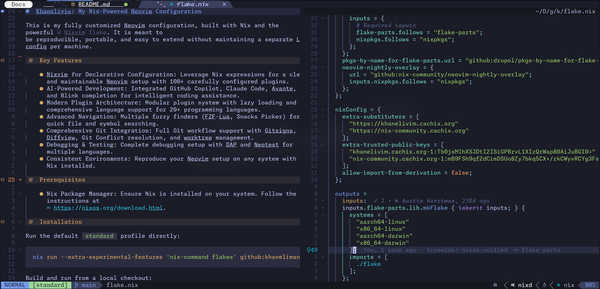

# Khanelivim: My Nix-Powered Neovim Configuration

This is my fully customized Neovim configuration, built with Nix and the
powerful [Nixvim flake](https://github.com/nix-community/nixvim). Enjoy a
consistent, reproducible, and easy-to-manage Neovim environment across different
machines.



## Key Features

- **Nixvim for Declarative Configuration:** Leverage Nix expressions for a clean
  and maintainable Neovim setup. Easily add, remove, or update plugins, LSP
  servers, and other components.
- **Consistent Environments:** Reproduce your Neovim setup effortlessly on any
  system with Nix installed.
- **Plugin Management:** Seamlessly manage plugins using Nixvim's declarative
  configuration.
- **LSP Integration:** Built-in support for language servers and completion
  tools.
- **Customization:** Adapt to your preferences with additional plugins, themes,
  and key mappings (details below).

## Prerequisites

- **Nix Package Manager:** Ensure Nix is installed on your system. Follow the
  instructions at
  [https://nixos.org/download.html](https://nixos.org/download.html).

## Installation

**Option 1: Using `nix run` (Easiest):**

```bash
nix run github:khaneliman/khanelivim
```

**Option 2: Adding as a Flake Input:**

In your system's Nix configuration (e.g., ~/.config/nixpkgs/flake.nix or
~/.config/nixpkgs/home.nix), add the following:

```nix
    inputs = {
      nixpkgs.url = "github:NixOS/nixpkgs/nixos-unstable";  # Or your preferred channel
      khanelivim.url = "github:khaneliman/khanelivim";
    };

    outputs = { self, nixpkgs, khanelivim }: {
      # ... your other configuration ...

      # Add to your system packages or devShell if you want to make it available system-wide
      packages = with nixpkgs; [
        khanelivim.packages.${system}.default
      ];

      # Or, use in a devShell:
      devShells.default = nixpkgs.mkShell {
        nativeBuildInputs = [ khanelivim.packages.${system}.default ];
      };
    };
```

**Option 3: Build and run locally:**

```bash
nix build . && ./result/bin/nvim
```

### Updating

```bash
nix flake update
```

### Rebuild your Neovim:

```bash
nix build
```

### Run the updated Neovim:

```bash
./result/bin/nvim
```

### Enter Nix Shell:

```bash
cd ~/.config/nvim nix develop
```

*(If you have direnv installed, it should automatically activate the environment
when you cd into the directory.)

## Plugins

- UI/UX Enhancements:
  - bufferline: A buffer line to show open buffers
  - catppuccin: A color theme with a focus on aesthetics
  - lualine: A highly customizable statusline
  - mini.nvim: A collection of minimalist plugins
  - neo-tree: A file explorer
  - noice.nvim: A highly customizable notification system
  - which-key: A popup that displays possible keybindings
  - yazi: A plugin that is the best way to navigate filesystems

- Git Integration:
  - git-conflict: A plugin to help resolve git conflicts
  - git-worktree: A plugin to help manage git worktrees
  - gitsigns.nvim: A plugin that provides git integration

- Coding Productivity:
  - cmp: A completion engine
  - codeium: An AI powered autocompletion tool
  - conform.nvim: A formatter
  - dap: A debugger adapter protocol
  - illuminate: A plugin that highlights occurrences of the word under the
    cursor
  - leap: A motion plugin to jump to any word in the visible text
  - lightbulb: A plugin that shows a lightbulb when code actions are available
  - lsp: Language server protocol integration
  - navic: A navigation plugin that uses lsp symbols to provide a breadcrumb
    trail
  - neotest: A test runner
  - nvim-treesitter: A parser for better syntax highlighting and code navigation
  - project.nvim: A project management plugin
  - refactoring: A plugin to help with refactoring code
  - telescope: A fuzzy finder
  - trouble.nvim: A diagnostics list

- Note Taking and Markdown:
  - neorg: A note taking plugin
  - markdown-preview: A plugin to preview markdown files
  - markview: A plugin to view markdown files

- Other:
  - colorizer: A plugin that shows colors in css, scss, sass, html, and
    javascript files
  - debugprint: A plugin that makes it easier to debug print statements
  - diffview: A plugin to view diffs
  - dirtytalk: A plugin that provides some funny messages
  - efm: A file manager
  - glow.nvim: A markdown previewer
  - harpoon: A plugin to mark and quickly navigate between files
  - hop.nvim: A plugin to quickly jump to any location on the screen
  - indent-blankline.nvim: A plugin that shows indent lines
  - smartcolumn: A plugin to automatically adjust column widths
  - spectre: A search and replace tool
  - statuscol: A plugin to show git status in the sign column
  - todo-comments: A plugin to highlight todo comments
  - toggleterm: A terminal emulator
  - undotree: A plugin to visualize the undo tree
  - wakatime: A plugin that tracks your time spent coding
  - wilder: A fuzzy finder
  - yanky: A clipboard manager

## LSP (Language Server Protocol) Configuration

This configuration emphasizes LSP support to enhance your coding experience with
features like:

- Diagnostics: Visual feedback for errors, warnings, hints, and information
  using symbols (e.g., ❌ for errors).
- Navigation: Quickly jump to definitions, references, implementations, and type
  definitions.
- Code Actions: Access context-aware suggestions for code improvements.
- Hover Information: Get detailed information about symbols by hovering over
  them.
- Rename: Refactor symbols accurately across your codebase.
- Formatting: Automatically format your code (either through a dedicated
  formatter or LSP capabilities).

### Key LSP Plugins:

- `lspkind`: Provides informative icons for LSP completions.
- `lsp-lines`: Enhances the display of LSP diagnostics within the code lines.
- `lsp-format`: Integrates LSP formatting capabilities (if you're not using the
  `conform-nvim` plugin).
- `nvim-jdtls`: Configures the Java LSP server (jdtls).

### LSP Servers:

The configuration includes a comprehensive list of LSP servers to support
various programming languages, including:

- Bash/Shell (bashls)
- C/C++ (ccls, clangd)
- CMake (cmake)
- C# (csharp-ls)
- CSS/Less/SCSS (cssls)
- Docker (dockerls)
- JavaScript/TypeScript (eslint, tsserver)
- F# (fsautocomplete)
- Godot (gdscript)
- HTML (html)
- Java (java-language-server or jdt-language-server)
- JSON (jsonls)
- Lua (lua-ls)
- Markdown (marksman)
- Nix (nil-ls)
- Python (pyright)
- Rust (rust-analyzer, optionally if not using rustaceanvim)
- SQL (sqls)
- TOML (taplo)
- YAML (yamlls)

Each server has specific settings tailored to its language, such as filetype
associations, initialization options, and formatting configurations.

### Custom Keymappings:

The configuration defines key mappings for common LSP actions under the
`<leader>l` prefix:

- `<leader>la`: Code actions
- `<leader>ld`: Go to definition
- `<leader>lf`: Format code (in visual mode)
- `<leader>lD`: Find references
- `<leader>lt`: Go to type definition
- `<leader>li`: Go to implementation
- `<leader>lh`: Hover for information
- `<leader>lr`: Rename symbol

### Additional Notes:

- You can enable/disable specific LSP servers based on your needs.
- The `nvim-jdtls` plugin configuration is separate due to its specific
  requirements.
- The `lsp-format` plugin is conditionally enabled if you're not using
  `conform-nvim` for formatting.
- You can further customize the LSP behavior in your Neovim config.

## Key Mappings

### Normal Mode

| Key          | Action                      | Description                                |
| ------------ | --------------------------- | ------------------------------------------ |
| `<Space>`    | `<NOP>`                     | Disable default space behavior             |
| `<Esc>`      | `:noh<CR>`                  | Clear search highlighting                  |
| `<BS>`       | `<BS>x`                     | Delete character with backspace            |
| `Y`          | `y$`                        | Yank to end of line                        |
| `<C-c>`      | `:b#<CR>`                   | Switch between recent buffers              |
| `<leader>[`  | `<C-w>h`                    | Move to left window                        |
| `<leader>]`  | `<C-w>l`                    | Move to right window                       |
| `<C-k>`      | `:cnext<CR>`                | Next quickfix item                         |
| `<C-j>`      | `:cprev<CR>`                | Previous quickfix item                     |
| `<C-Up>`     | `:resize -2<CR>`            | Decrease window height                     |
| `<C-Down>`   | `:resize +2<CR>`            | Increase window height                     |
| `<C-Left>`   | `:vertical resize +2<CR>`   | Increase window width                      |
| `<C-Right>`  | `:vertical resize -2<CR>`   | Decrease window width                      |
| `<M-k>`      | `:move-2<CR>`               | Move line up (Alt+k)                       |
| `<M-j>`      | `:move+<CR>`                | Move line down (Alt+j)                     |
| `<Leader>w`  | `<Cmd>w<CR>`                | Save file                                  |
| `j`          | `v:count == 0 ? 'gj' : 'j'` | Move cursor down (smart for wrapped lines) |
| `k`          | `v:count == 0 ? 'gk' : 'k'` | Move cursor up (smart for wrapped lines)   |
| `<Leader>q`  | `<Cmd>confirm q<CR>`        | Quit with confirmation                     |
| `<C-n>`      | `<Cmd>enew<CR>`             | New file                                   |
| `<leader>W`  | `<Cmd>w!<CR>`               | Force write                                |
| `<leader>Q`  | `<Cmd>q!<CR>`               | Force quit                                 |
| `\|`         | `<Cmd>vsplit<CR>`           | Vertical split                             |
| `\`          | `<Cmd>split<CR>`            | Horizontal split                           |
| `<leader>bC` | `:%bd!<CR>`                 | Close all buffers                          |
| `<leader>b]` | `:bnext<CR>`                | Next buffer                                |
| `<TAB>`      | `:bnext<CR>`                | Next buffer (default)                      |
| `<leader>b[` | `:bprevious<CR>`            | Previous buffer                            |
| `<S-TAB>`    | `:bprevious<CR>`            | Previous buffer                            |

### Toggle Mappings

| Key          | Action       | Description                   |
| ------------ | ------------ | ----------------------------- |
| `<leader>ud` | Lua function | Toggle buffer diagnostics     |
| `<leader>uD` | Lua function | Toggle global diagnostics     |
| `<leader>uf` | Lua function | Toggle buffer auto-formatting |
| `<leader>uF` | Lua function | Toggle global auto-formatting |
| `<leader>uS` | Lua function | Toggle spell check            |
| `<leader>uw` | Lua function | Toggle word wrap              |
| `<leader>uh` | Lua function | Toggle fold column            |
| `<leader>uc` | Lua function | Toggle completions            |

### Visual Mode

| Key       | Action             | Description                   |
| --------- | ------------------ | ----------------------------- |
| `<S-Tab>` | `<gv`              | Unindent line                 |
| `<`       | `<gv`              | Unindent line                 |
| `<Tab>`   | `>gv`              | Indent line                   |
| `>`       | `>gv`              | Indent line                   |
| `K`       | `:m '<-2<CR>gv=gv` | Move selected line/block up   |
| `J`       | `:m '>+1<CR>gv=gv` | Move selected line/block down |
| `<BS>`    | `x`                | Delete character              |

### Insert Mode

| Key     | Action    | Description          |
| ------- | --------- | -------------------- |
| `<C-k>` | `<C-o>gk` | Move line/block up   |
| `<C-j>` | `<C-o>gj` | Move line/block down |
| `<C-h>` | `<Left>`  | Move Cursor Left     |
| `<C-l>` | `<Right>` | Move Cursor Right    |

For the full configuration details, please explore the flake.nix file in the
repository.

## Customization / Contributing

Feel free to fork the repository and modify the flake.nix file to personalize
your Neovim configuration. Contributing

Pull requests are welcome! If you'd like to make improvements, please open an
issue or submit a PR.
