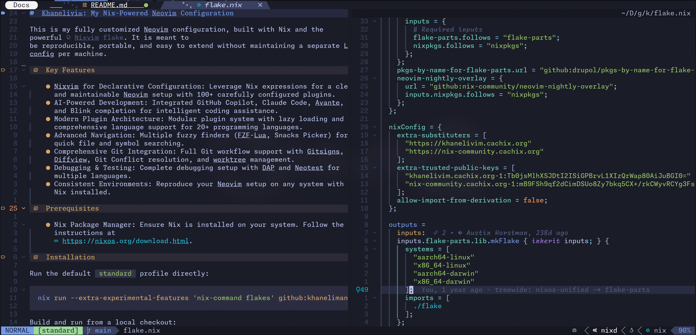

# Khanelivim: My Nix-Powered Neovim Configuration

This is my fully customized Neovim configuration, built with Nix and the
powerful [Nixvim flake](https://github.com/nix-community/nixvim). It is meant to
be reproducible, portable, and easy to extend without maintaining a separate Lua
config per machine.



## Key Features

- **Nixvim for Declarative Configuration:** Leverage Nix expressions for a clean
  and maintainable Neovim setup with 100+ carefully configured plugins.
- **AI-Powered Development:** Integrated GitHub Copilot, Claude Code, Avante,
  and Blink completion for intelligent coding assistance.
- **Modern Plugin Architecture:** Modular plugin system with lazy loading and
  comprehensive language support for 20+ programming languages.
- **Advanced Navigation:** Multiple fuzzy finders (FZF-Lua, Snacks Picker) for
  quick file and symbol searching.
- **Comprehensive Git Integration:** Full Git workflow support with Gitsigns,
  Diffview, Git Conflict resolution, and worktree management.
- **Debugging & Testing:** Complete debugging setup with DAP and Neotest for
  multiple languages.
- **Consistent Environments:** Reproduce your Neovim setup on any system with
  Nix installed.

## Prerequisites

- **Nix Package Manager:** Ensure Nix is installed on your system. Follow the
  instructions at
  [https://nixos.org/download.html](https://nixos.org/download.html).

## Installation

Run the default `standard` profile directly:

```bash
nix run --extra-experimental-features 'nix-command flakes' github:khaneliman/khanelivim
```

Build and run from a local checkout:

```bash
git clone https://github.com/khaneliman/khanelivim.git
cd khanelivim
nix run
```

Install it from Home Manager via `home.packages`:

```nix
{
  home.packages = [
    khanelivim.packages.${pkgs.system}.default
  ];
}
```

## Docs

The generated docs are the canonical reference for profiles, options, and
workflow details.

```bash
nix build .#docs-html
nix run .#docs
```

Start here:

- `Using the Flake` for the supported ways to run, install, and customize this
  config
- `Keymaps` for generated, UX-oriented keybinding pages
- `Selecting Profiles` for `minimal`, `basic`, `standard`, `full`, and `debug`
- `Options Reference` for the `khanelivim.*` module surface
- `Profile Matrix` for the evaluated differences between profiles
- `Language Tooling Workflows` for the runtime LSP and language-tooling model

## Development Commands

```bash
# Update flake dependencies
nix flake update

# Check flake for issues
nix flake check

# Format/lint code
nix fmt
deadnix -e
statix fix .

# Enter development shell
nix develop

# Run Neovim
nix run
```
