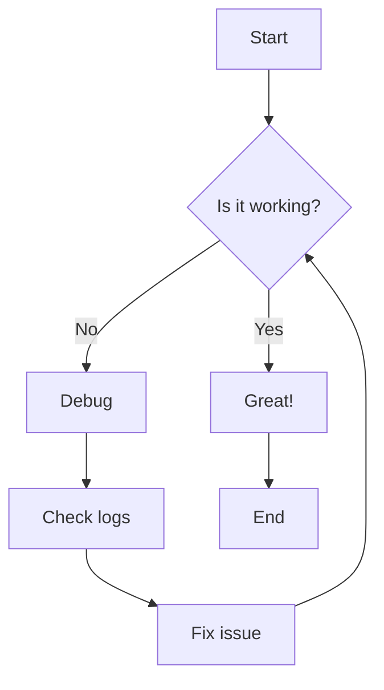
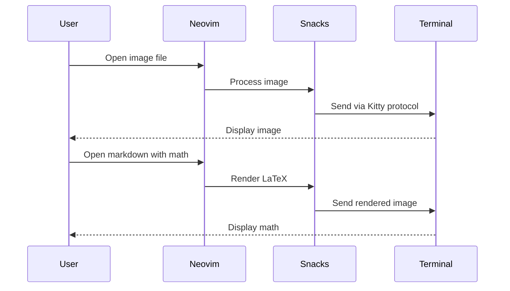
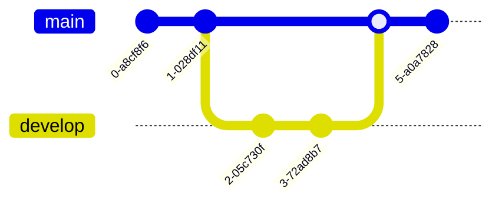
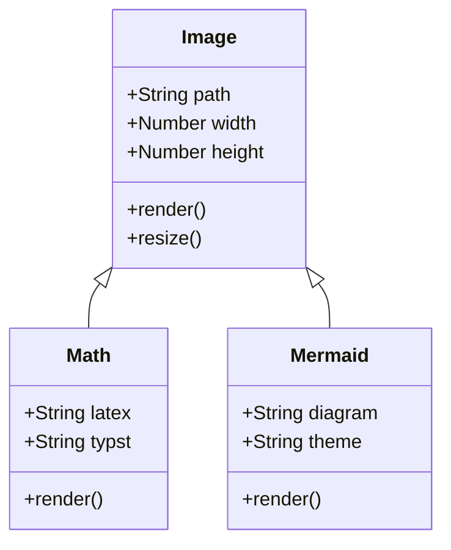
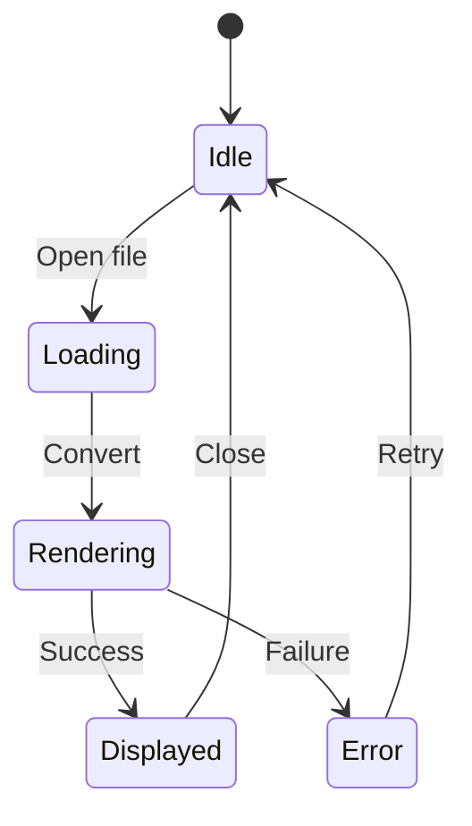

# Snacks Image Module Test File

This file tests the various image rendering capabilities of the snacks.nvim
image module.

## Math Expressions

### Inline Math

The quadratic formula is $x = \frac{-b \pm \sqrt{b^2 - 4ac}}{2a}$ and Einstein's
famous equation is $E = mc^2$.

### Block Math

Here's the Pythagorean theorem:

$$
a^2 + b^2 = c^2
$$

Some calculus:

$$
\int_{a}^{b} f(x) \, dx = F(b) - F(a)
$$

Matrix example:

# $$ \begin{pmatrix} a & b \\ c & d \end{pmatrix} \begin{pmatrix} x \\ y \end{pmatrix}

\begin{pmatrix} ax + by \\ cx + dy \end{pmatrix} $$

### Advanced Math

Summation notation:

$$
\sum_{i=1}^{n} i = \frac{n(n+1)}{2}
$$

Limits:

$$
\lim_{x \to \infty} \frac{1}{x} = 0
$$

Greek letters and symbols:

$$
\alpha, \beta, \gamma, \Delta, \Sigma, \Omega
$$

## Mermaid Diagrams

### Flowchart

### Sequence Diagram

### Git Graph

### Class Diagram

### State Diagram

## Sample Images (from URLs)

### PNG Image

### SVG Image

### GitHub User Avatar

## Testing Instructions

1. Open this file in Neovim with snacks.nvim configured
2. Math expressions should render automatically
3. Mermaid diagrams should render as images
4. URL images should be fetched and displayed inline
5. Use `:checkhealth snacks` to verify image support

## Keybindings to Test

- Position cursor over an image/math expression
- Run `:lua Snacks.image.hover()` to view in floating window
- Images should automatically render inline in Kitty terminal

## Expected Behavior

- **Math**: Should render as typeset equations
- **Mermaid**: Should render as diagrams with dark theme
- **Images**: Should display inline or in floating window
- **Performance**: Should be smooth with caching enabled
